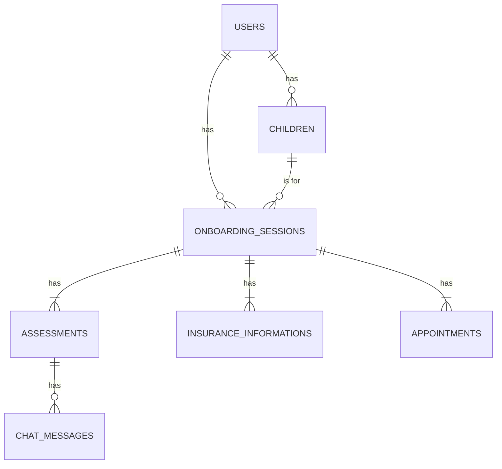

# Backend Technical Specification: Parent Onboarding AI

**Version:** 1.0
**Date:** November 28, 2025
**Corresponding Frontend Spec:** `frontend_spec.md`

---

## 1. Introduction

This document provides a detailed technical specification for the backend of the Daybreak Health Parent Onboarding AI platform. The backend is a Ruby on Rails 7 application running in API-only mode. Its primary responsibilities are to provide a secure GraphQL API, manage data persistence, execute business logic, and integrate with external services like OpenAI and AWS.

This specification is the source of truth for the backend development team. It is designed to be read alongside the `api_schema.graphql` file, which defines the definitive contract between the backend and the frontend.

## 2. Core Responsibilities

-   **Serve a GraphQL API:** Expose all data and business logic through a secure and well-defined GraphQL endpoint.
-   **Data Persistence:** Manage all application data using a PostgreSQL database, ensuring data integrity and security.
-   **Authentication & Authorization:** Handle user authentication and enforce role-based access control (RBAC).
-   **Business Logic Execution:** Implement the core logic for onboarding, assessments, scheduling, and other features.
-   **External Service Integration:** Communicate with third-party APIs, including OpenAI for AI assessment and AWS Textract for OCR.
-   **Real-time Communication:** Power the real-time support chat via WebSockets (Action Cable).
-   **Background Job Processing:** Execute long-running tasks asynchronously (e.g., OCR processing, sending notifications).

## 3. Database Schema

The database will be hosted on Amazon RDS for PostgreSQL. The schema is designed to be relational and normalized, with foreign key constraints to maintain data integrity. All tables will have `id` (UUID), `created_at`, and `updated_at` columns by default.

| Table Name | Columns | Indexes | Description |
| :--- | :--- | :--- | :--- |
| **`users`** | `email` (string, unique), `first_name` (string), `last_name` (string), `role` (enum) | `email` | Stores parent and support staff user accounts. |
| **`children`** | `user_id` (fk), `first_name` (string), `date_of_birth` (date), `pronouns` (string) | `user_id` | Stores information about the child associated with a parent user. |
| **`onboarding_sessions`** | `user_id` (fk), `child_id` (fk), `status` (enum) | `user_id`, `child_id` | The central model tracking a parent's journey through the onboarding flow. |
| **`assessments`** | `onboarding_session_id` (fk), `summary` (text), `is_fit` (boolean), `next_steps` (text) | `onboarding_session_id` | Stores the state and outcome of the AI-powered mental health assessment. |
| **`chat_messages`** | `assessment_id` (fk), `sender` (enum), `content` (text) | `assessment_id` | Stores the full conversation history for an assessment or support chat. |
| **`insurance_informations`** | `onboarding_session_id` (fk), `provider` (string), `member_id` (string), `group_id` (string), `image_url` (string) | `onboarding_session_id` | Stores insurance details, either entered manually or extracted via OCR. |
| **`appointments`** | `onboarding_session_id` (fk), `therapist_name` (string), `start_time` (datetime), `end_time` (datetime) | `onboarding_session_id` | Stores details of the scheduled first appointment. |

**Entity-Relationship Diagram (Mermaid):**


## 4. GraphQL API Implementation

The API will be implemented using the `graphql-ruby` gem. The schema is defined in `api_schema.graphql`. Below are implementation details for key resolvers.

### Queries

-   **`getOnboardingSession(id: ID!)`**: Fetches the `OnboardingSession` by its ID. Must authorize that the `current_user` is either the parent associated with the session or a support staff member.
-   **`me`**: Returns the `current_user` object based on the JWT token provided in the `Authorization` header.

### Mutations

-   **`startOnboarding`**: 
    1.  Find or create a `User` with the provided email.
    2.  Create a `Child` record associated with the user.
    3.  Create an `OnboardingSession` with status `ASSESSMENT_STARTED`.
    4.  Create an associated `Assessment` record.
    5.  Generate a JWT for the user and return it alongside the `OnboardingSession` data.
-   **`submitAssessmentMessage`**:
    1.  Authorize the user against the `onboardingSessionId`.
    2.  Create a `ChatMessage` with `sender: USER` and save it.
    3.  Instantiate an `OpenAIService` class.
    4.  Call the service with the full conversation history.
    5.  Receive the AI's response.
    6.  Create a new `ChatMessage` with `sender: AI` and save it.
    7.  Return the updated `Assessment` object.
-   **`submitInsuranceImage` (P1)**:
    1.  This mutation will handle a multipart file upload.
    2.  The uploaded file will be streamed directly to an AWS S3 bucket.
    3.  An `InsuranceInformation` record is created with a placeholder status.
    4.  An `InsuranceOcrJob` is enqueued with the ID of the `InsuranceInformation` record.
    5.  The mutation immediately returns the `InsuranceInformation` record with its ID and a `PROCESSING` status.
-   **`sendSupportChatMessage` (P1)**:
    1.  Create and save a `ChatMessage` with `sender: USER` or `sender: SUPPORT`.
    2.  Broadcast the new message over the appropriate Action Cable channel using `SupportChatChannel.broadcast_to(...)`.

## 5. Authentication & Authorization

-   **Authentication:** A stateless JWT-based system will be used. The `startOnboarding` mutation will act as a login/signup, returning a token. Subsequent requests must include the token in the `Authorization: Bearer <token>` header.
-   **Authorization:** A policy-based approach (e.g., using the Pundit gem) will be implemented. A `OnboardingSessionPolicy` will ensure that a user can only access sessions they own. A `UserPolicy` will restrict access based on roles (`PARENT`, `SUPPORT_STAFF`).

## 6. Service Integrations

Business logic for external services will be encapsulated in dedicated service classes under `app/services`.

-   **`OpenaiService`**: 
    -   Manages the connection to the OpenAI GPT-4 API.
    -   Holds the system prompt that instructs the AI on its persona (empathetic, supportive, non-clinical).
    -   Formats the conversation history into the required prompt structure.
    -   Handles API key management securely via Rails credentials.
-   **`Aws::TextractService` (P1)**:
    -   Manages the connection to the AWS Textract API.
    -   Contains logic to start an analysis job on a document in S3.
    -   Includes logic to parse the key-value pairs from the Textract response, specifically looking for fields like "Member ID", "Group ID", etc.

## 7. Background Jobs & Real-time

### 7.1 Background Jobs (Sidekiq)

Sidekiq will be used for all asynchronous processing:

-   `InsuranceOcrJob (P1)`: Triggered after an insurance card is uploaded. It calls the `Aws::TextractService` and updates the `InsuranceInformation` record with the extracted data.
-   `AppointmentReminderJob (P2)`: A scheduled job to send email or SMS reminders before an appointment.

### 7.2 Real-time: GraphQL Subscriptions over Action Cable (P1)

All real-time features use **GraphQL subscriptions** with Action Cable as the WebSocket transport layer. This provides a unified GraphQL-first API for both request/response and real-time operations.

**Architecture:**
-   Schema configuration: `use GraphQL::Subscriptions::ActionCableSubscriptions`
-   `GraphqlChannel` handles the subscription lifecycle (subscribe/execute/unsubscribe)
-   Mutations trigger subscriptions via `ParentOnboardingSchema.subscriptions.trigger()`

**Key Subscription:**
```graphql
type Subscription {
  supportChatMessages(onboardingSessionId: ID!): ChatMessage
}
```

**Trigger Pattern:**
When a support chat message is created (via mutation or service), the subscription is triggered:
```ruby
ParentOnboardingSchema.subscriptions.trigger(
  :support_chat_messages,
  { onboarding_session_id: session_id },
  message
)
```

**Production Adapter Options:**
| Adapter | Use Case |
| :--- | :--- |
| Redis | Standard choice, requires Redis instance |
| Solid Cable | Database-backed, simpler for Aptible (no Redis needed) |

> **Implementation Reference:** See `docs/backend-graphql-subscriptions-guide.md` for complete implementation details including channel setup, JWT authentication over WebSocket, and CORS configuration.

## 8. Directory Structure (Rails API)

```
parent-onboarding-backend/
├── app/
│   ├── channels/
│   │   ├── application_cable/
│   │   │   ├── channel.rb           # Base channel class
│   │   │   └── connection.rb        # JWT auth for WebSocket connections
│   │   └── graphql_channel.rb       # GraphQL subscription handler
│   ├── graphql/
│   │   ├── mutations/               # GraphQL mutations
│   │   ├── types/
│   │   │   ├── query_type.rb
│   │   │   ├── mutation_type.rb
│   │   │   └── subscription_type.rb # Real-time subscriptions
│   │   └── parent_onboarding_schema.rb
│   ├── jobs/                        # Sidekiq background jobs
│   ├── models/                      # ActiveRecord models
│   ├── policies/                    # Pundit authorization policies
│   └── services/                    # Service objects (OpenaiService, etc.)
├── config/
│   ├── cable.yml                    # Action Cable adapter config
│   └── initializers/
│       └── cors.rb                  # CORS config for WebSocket
├── db/
└── spec/                            # RSpec tests mirroring app structure
```

## 9. Getting Started (Local Setup)

1.  Clone the `parent-onboarding-backend` repository.
2.  Install Ruby, Bundler, and PostgreSQL.
3.  Run `bundle install`.
4.  Set up environment variables for the database, OpenAI API key, and AWS credentials in `.env`.
5.  Run `rails db:create db:migrate`.
6.  Run `rails server` to start the API on `localhost:3001`.
